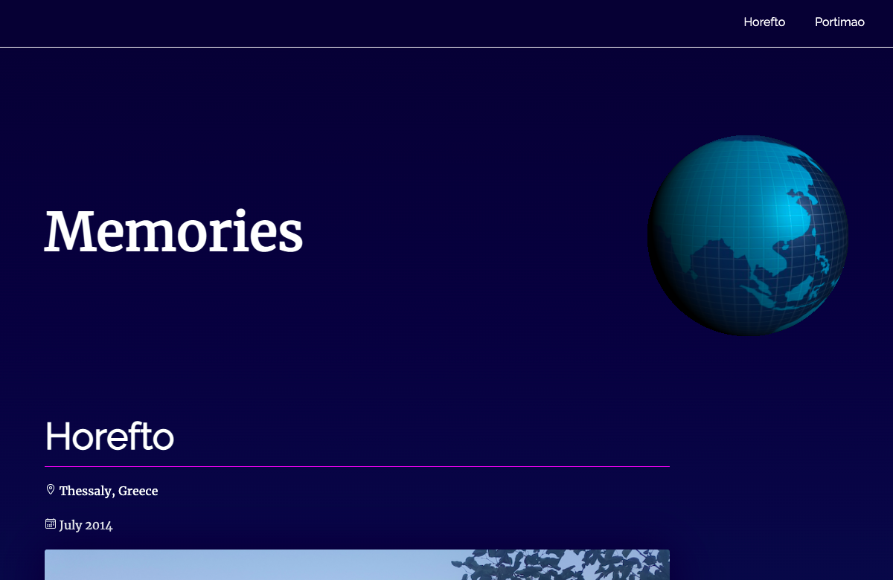

# Memories

## About

A simple one page website displaying holiday memories and featuring a dynamic navbar, active sections, smooth scrolling and lazy loading images, as well as a three.js spinning globe.



## Technologies

HTML, CSS, JavaScript, Three.

## Installation Instructions

```
$ git clone https://github.com/HannaEb/memories.git
```

Then simply open the website with you favourite text editor.

## Author

HannaEb
